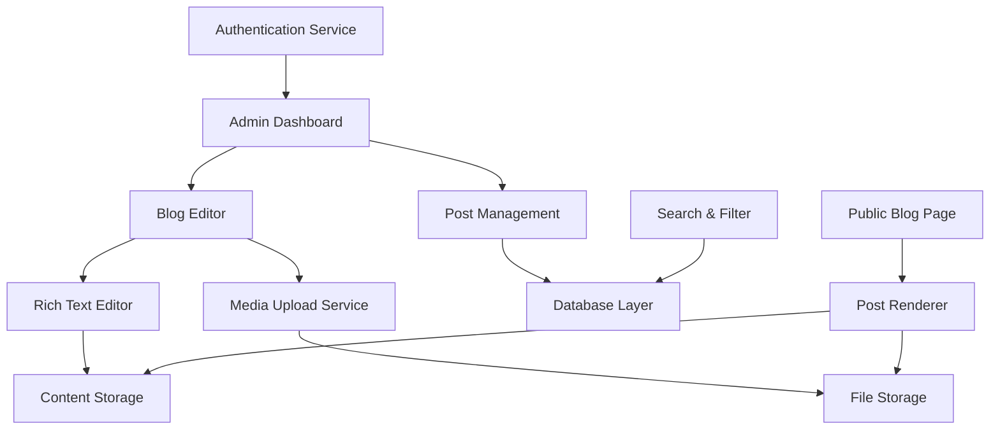

# Design Document

## Overview

The admin blog system will be a comprehensive content management solution integrated into the existing Nefer Kali Healing platform. It will provide a secure admin interface for creating, editing, and managing rich media blog posts, along with a public-facing blog display that maintains the platform's cosmic spiritual aesthetic. The system will leverage Next.js App Router, TypeScript, and the existing design system to create a seamless experience for both administrators and visitors.

## Architecture

### High-Level Architecture



### System Components

1. **Admin Authentication Layer**: Secure login and session management
2. **Blog Editor Interface**: Rich text editing with media embedding
3. **Media Management Service**: File upload, processing, and optimization
4. **Content Storage Layer**: Database schema for posts, metadata, and relationships
5. **Public Blog Interface**: Responsive display with cosmic theming
6. **Search and Filter System**: Content discovery functionality

## Components and Interfaces

### Admin Components

#### AdminLayout Component
```typescript
interface AdminLayoutProps {
  children: React.ReactNode;
  user: AdminUser;
}
```
- Provides consistent admin interface layout
- Includes navigation sidebar with cosmic theming
- Handles authentication state and redirects

#### BlogEditor Component
```typescript
interface BlogEditorProps {
  post?: BlogPost;
  onSave: (post: BlogPost) => Promise<void>;
  onPublish: (post: BlogPost) => Promise<void>;
}
```
- Rich text editor with cosmic-themed toolbar
- Real-time auto-save functionality
- Media embedding capabilities
- Preview mode integration

#### MediaUploader Component
```typescript
interface MediaUploaderProps {
  onUpload: (media: MediaFile) => void;
  acceptedTypes: string[];
  maxSize: number;
}
```
- Drag-and-drop file upload interface
- Image and video processing
- Progress indicators with cosmic animations
- File validation and error handling

#### PostManager Component
```typescript
interface PostManagerProps {
  posts: BlogPost[];
  onEdit: (postId: string) => void;
  onDelete: (postId: string) => Promise<void>;
  onStatusChange: (postId: string, status: PostStatus) => Promise<void>;
}
```
- Tabular display of all blog posts
- Bulk operations support
- Status management (draft, published, scheduled)
- Search and filter capabilities

### Public Components

#### BlogPage Component
```typescript
interface BlogPageProps {
  posts: BlogPost[];
  searchQuery?: string;
  selectedTag?: string;
}
```
- Grid layout for blog post previews
- Cosmic-themed card components
- Pagination with smooth animations
- Search and filter integration

#### BlogPost Component
```typescript
interface BlogPostProps {
  post: BlogPost;
  isPreview?: boolean;
}
```
- Full post rendering with rich media
- Cosmic typography and spacing
- Responsive image and video handling
- Social sharing integration

#### SearchFilter Component
```typescript
interface SearchFilterProps {
  onSearch: (query: string) => void;
  onTagFilter: (tag: string) => void;
  availableTags: string[];
}
```
- Real-time search functionality
- Tag-based filtering
- Cosmic-themed input components
- Search suggestions and autocomplete

## Data Models

### BlogPost Model
```typescript
interface BlogPost {
  id: string;
  title: string;
  slug: string;
  content: string; // Rich HTML content
  excerpt: string;
  featuredImage?: MediaFile;
  tags: string[];
  status: PostStatus;
  publishedAt?: Date;
  scheduledFor?: Date;
  createdAt: Date;
  updatedAt: Date;
  authorId: string;
  metadata: PostMetadata;
}

enum PostStatus {
  DRAFT = 'draft',
  PUBLISHED = 'published',
  SCHEDULED = 'scheduled',
  ARCHIVED = 'archived'
}

interface PostMetadata {
  readingTime: number;
  wordCount: number;
  seoTitle?: string;
  seoDescription?: string;
  canonicalUrl?: string;
}
```

### MediaFile Model
```typescript
interface MediaFile {
  id: string;
  filename: string;
  originalName: string;
  mimeType: string;
  size: number;
  url: string;
  thumbnailUrl?: string;
  altText?: string;
  caption?: string;
  uploadedAt: Date;
  metadata: MediaMetadata;
}

interface MediaMetadata {
  width?: number;
  height?: number;
  duration?: number; // For videos
  format: string;
  optimized: boolean;
}
```

### AdminUser Model
```typescript
interface AdminUser {
  id: string;
  email: string;
  name: string;
  role: AdminRole;
  permissions: Permission[];
  lastLoginAt: Date;
  createdAt: Date;
}

enum AdminRole {
  SUPER_ADMIN = 'super_admin',
  EDITOR = 'editor',
  AUTHOR = 'author'
}

enum Permission {
  CREATE_POST = 'create_post',
  EDIT_POST = 'edit_post',
  DELETE_POST = 'delete_post',
  PUBLISH_POST = 'publish_post',
  MANAGE_MEDIA = 'manage_media'
}
```

## Error Handling

### Client-Side Error Handling
- Form validation with real-time feedback
- File upload error handling with user-friendly messages
- Network error recovery with retry mechanisms
- Graceful degradation for unsupported features

### Server-Side Error Handling
- Input validation and sanitization
- File upload security checks
- Database transaction rollbacks
- Comprehensive error logging

### Error UI Components
```typescript
interface ErrorBoundaryProps {
  fallback: React.ComponentType<{error: Error}>;
  children: React.ReactNode;
}
```
- Cosmic-themed error displays
- Recovery action suggestions
- Error reporting functionality
- Graceful fallbacks for media loading

## Testing Strategy

### Unit Testing
- Component testing with React Testing Library
- Service layer testing with Jest
- Database model validation testing
- Media processing function testing

### Integration Testing
- API endpoint testing
- File upload workflow testing
- Authentication flow testing
- Database integration testing

### End-to-End Testing
- Complete blog creation workflow
- Media upload and embedding
- Public blog viewing experience
- Search and filter functionality

### Performance Testing
- Media file optimization validation
- Page load time measurement
- Database query performance
- Mobile responsiveness testing

## Security Considerations

### Authentication & Authorization
- JWT-based admin authentication
- Role-based access control
- Session management and timeout
- CSRF protection for admin forms

### Content Security
- HTML sanitization for rich text content
- File type validation and scanning
- XSS prevention in user-generated content
- SQL injection prevention

### Media Security
- File size and type restrictions
- Image and video processing security
- CDN integration for secure delivery
- Malware scanning for uploaded files

## Performance Optimizations

### Media Optimization
- Automatic image compression and resizing
- Video transcoding for web delivery
- Lazy loading for media content
- CDN integration for fast delivery

### Content Delivery
- Static generation for published posts
- Incremental static regeneration
- Edge caching strategies
- Database query optimization

### User Experience
- Progressive loading for admin interface
- Real-time auto-save with debouncing
- Optimistic UI updates
- Smooth cosmic animations without performance impact

## Integration Points

### Existing Platform Integration
- Consistent cosmic theming and animations
- Integration with existing authentication system
- Shared component library usage
- Unified navigation and layout

### Third-Party Services
- Cloud storage for media files (AWS S3 or similar)
- CDN for content delivery
- Email notifications for publishing
- Analytics integration for blog performance

### API Design
- RESTful endpoints for CRUD operations
- GraphQL consideration for complex queries
- Real-time updates via WebSocket (future)
- Comprehensive API documentation