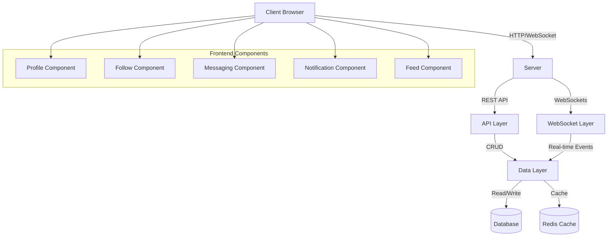

# Design Document: Community Platform Core

## Overview

The Community Platform Core will transform the Nefer Kali Healing website into an interactive spiritual community. This design document outlines the architecture, components, data models, and implementation strategies for building a robust social platform that maintains the site's cosmic aesthetic while providing modern social networking capabilities.

The platform will consist of five key components:
1. User Profile System with cosmic avatars
2. Following/Followers functionality
3. Direct Messaging system with real-time updates
4. Notification system for social interactions
5. Community Feed structure

## Architecture

The Community Platform Core will follow a modern, scalable architecture:

### Frontend Architecture
- **Component-Based Structure**: Using React components with TypeScript for type safety
- **State Management**: Redux for global state management with Redux Toolkit for simplified logic
- **Real-time Communication**: Socket.io client for real-time messaging and notifications
- **Styling**: Tailwind CSS with custom cosmic theme extensions
- **Animations**: GSAP and Framer Motion for smooth transitions and effects

### Backend Architecture
- **API Layer**: RESTful endpoints for CRUD operations on profiles, follows, and feed content
- **WebSocket Layer**: Socket.io for real-time messaging and notifications
- **Authentication**: JWT-based authentication with refresh tokens
- **Data Persistence**: Database models for users, profiles, follows, messages, and notifications
- **Caching**: Redis for caching frequently accessed data and improving performance

### System Architecture Diagram



## Components and Interfaces

### 1. User Profile System

#### Components:
- **ProfilePage**: Main profile view with cosmic avatar, bio, and stats
- **ProfileEditor**: Form for editing profile information
- **CosmicAvatarGenerator**: AI-based avatar generation based on birth chart
- **SpiritualBadges**: Display of achievements and participation badges
- **InterestTags**: Display and management of spiritual interests

#### Interfaces:
```typescript
interface UserProfile {
  userId: string;
  displayName: string;
  cosmicAvatar: string;
  spiritualBio: string;
  joinDate: Date;
  astrologicalSummary: {
    sunSign: string;
    moonSign: string;
    ascendant: string;
  };
  ayurvedicType: {
    primaryDosha: string;
    secondaryDosha: string;
    balance: number[];
  };
  badges: Badge[];
  interests: string[];
}

interface Badge {
  id: string;
  name: string;
  description: string;
  iconUrl: string;
  dateEarned: Date;
}
```

### 2. Following/Followers System

#### Components:
- **FollowButton**: Button to follow/unfollow users
- **FollowersList**: Display of users following the current user
- **FollowingList**: Display of users the current user follows
- **SuggestedUsers**: Component showing recommended users to follow
- **MutualConnections**: Display of shared connections between users

#### Interfaces:
```typescript
interface FollowRelationship {
  id: string;
  followerId: string;
  followingId: string;
  createdAt: Date;
}

interface FollowStats {
  userId: string;
  followerCount: number;
  followingCount: number;
}

interface UserSuggestion {
  userId: string;
  displayName: string;
  cosmicAvatar: string;
  mutualConnections: number;
  sharedInterests: string[];
  relevanceScore: number;
}
```

### 3. Direct Messaging System

#### Components:
- **MessageInbox**: List of all message threads
- **MessageThread**: Individual conversation view
- **MessageComposer**: Input area for creating messages
- **VoiceMessageRecorder**: Interface for recording audio messages
- **MessageReactions**: UI for adding spiritual emoji reactions
- **CosmicChatInterface**: Styled chat bubbles with cosmic theme

#### Interfaces:
```typescript
interface MessageThread {
  id: string;
  participants: string[];
  lastMessage: Message;
  unreadCount: number;
  updatedAt: Date;
}

interface Message {
  id: string;
  threadId: string;
  senderId: string;
  content: string;
  contentType: 'text' | 'voice' | 'image';
  mediaUrl?: string;
  reactions: MessageReaction[];
  readBy: string[];
  createdAt: Date;
}

interface MessageReaction {
  userId: string;
  emoji: string;
  createdAt: Date;
}
```

### 4. Notification System

#### Components:
- **NotificationCenter**: Dropdown menu showing recent notifications
- **NotificationBadge**: Count indicator for unread notifications
- **NotificationItem**: Individual notification display
- **NotificationSettings**: Preferences for notification types

#### Interfaces:
```typescript
interface Notification {
  id: string;
  recipientId: string;
  type: 'follow' | 'message' | 'mention' | 'comment' | 'reaction';
  actorId: string;
  entityId?: string;
  entityType?: 'post' | 'comment' | 'message';
  read: boolean;
  createdAt: Date;
}

interface NotificationPreferences {
  userId: string;
  followNotifications: boolean;
  messageNotifications: boolean;
  mentionNotifications: boolean;
  commentNotifications: boolean;
  reactionNotifications: boolean;
  emailNotifications: boolean;
  pushNotifications: boolean;
}
```

### 5. Community Feed Structure

#### Components:
- **FeedContainer**: Main container for the feed
- **FeedTabs**: Navigation between different feed views (Following, Discover)
- **FeedItem**: Individual post display in the feed
- **FeedInteractions**: Like, comment, and share buttons
- **InfiniteScroller**: Component for loading more content on scroll

#### Interfaces:
```typescript
interface FeedItem {
  id: string;
  authorId: string;
  contentType: 'text' | 'image' | 'video';
  content: string;
  mediaUrl?: string;
  likeCount: number;
  commentCount: number;
  shareCount: number;
  createdAt: Date;
}

interface FeedFilter {
  sortBy: 'recent' | 'popular' | 'relevant';
  contentTypes?: ('text' | 'image' | 'video')[];
  followingOnly: boolean;
  interestTags?: string[];
}
```

## Data Models

### User Profile Model
```typescript
// Extends the existing User model
interface User {
  id: string;
  email: string;
  passwordHash: string;
  profile: UserProfile;
  followStats: FollowStats;
  notificationPreferences: NotificationPreferences;
  createdAt: Date;
  updatedAt: Date;
}
```

### Follow Model
```typescript
interface Follow {
  id: string;
  followerId: string;
  followingId: string;
  createdAt: Date;
}
```

### Message Models
```typescript
interface Thread {
  id: string;
  participants: string[];
  createdAt: Date;
  updatedAt: Date;
}

interface Message {
  id: string;
  threadId: string;
  senderId: string;
  content: string;
  contentType: 'text' | 'voice' | 'image';
  mediaUrl?: string;
  createdAt: Date;
}

interface MessageReaction {
  id: string;
  messageId: string;
  userId: string;
  emoji: string;
  createdAt: Date;
}
```

### Notification Model
```typescript
interface Notification {
  id: string;
  recipientId: string;
  type: 'follow' | 'message' | 'mention' | 'comment' | 'reaction';
  actorId: string;
  entityId?: string;
  entityType?: 'post' | 'comment' | 'message';
  read: boolean;
  createdAt: Date;
}
```

### Feed Item Model
```typescript
interface Post {
  id: string;
  authorId: string;
  contentType: 'text' | 'image' | 'video';
  content: string;
  mediaUrl?: string;
  createdAt: Date;
  updatedAt: Date;
}

interface Like {
  id: string;
  postId: string;
  userId: string;
  createdAt: Date;
}

interface Comment {
  id: string;
  postId: string;
  authorId: string;
  content: string;
  createdAt: Date;
  updatedAt: Date;
}
```

## Error Handling

### Error Types
1. **Authentication Errors**: Handle unauthorized access and token expiration
2. **Validation Errors**: Handle invalid input data
3. **Resource Errors**: Handle missing or inaccessible resources
4. **Connection Errors**: Handle WebSocket and network failures
5. **Rate Limiting Errors**: Handle excessive requests

### Error Handling Strategy
- **Frontend**: Toast notifications for user-facing errors with cosmic styling
- **API Layer**: Consistent error response format with error codes and messages
- **WebSocket Layer**: Reconnection logic and event retries
- **Logging**: Structured error logging for debugging and monitoring

## Testing Strategy

### Unit Testing
- Test individual components and functions
- Mock external dependencies and services
- Focus on business logic and edge cases

### Integration Testing
- Test interactions between components
- Test API endpoints and WebSocket events
- Verify data flow and state management

### End-to-End Testing
- Test complete user journeys
- Verify real-time functionality
- Test across different browsers and devices

### Performance Testing
- Test WebSocket connection handling
- Test feed rendering performance
- Test notification delivery latency

## UI/UX Design

### Profile Page Design
The profile page will feature a cosmic-themed layout with:
- Large cosmic avatar at the top
- Spiritual bio and interests below
- Astrological and Ayurvedic information in a cosmic card
- Badges displayed in a horizontal scrollable container
- Stats (followers, following, posts) in cosmic-styled counters
- Recent activity feed at the bottom

### Messaging Interface Design
The messaging interface will maintain the cosmic theme with:
- Starfield background with reduced opacity
- Message bubbles with cosmic gradients
- Voice messages displayed as cosmic waveforms
- Spiritual emoji reactions floating above messages
- Subtle animations for message delivery and reading

### Notification Design
Notifications will be designed with:
- Cosmic-themed dropdown menu
- Glowing indicator for unread notifications
- Animated entrance for new notifications
- Categorized by type with appropriate cosmic icons

### Feed Design
The community feed will feature:
- Cosmic card design for each post
- Smooth animations for loading and interactions
- Infinite scrolling with cosmic loading indicator
- Interactive elements with hover effects
- Responsive layout for all device sizes

## Implementation Considerations

### Performance Optimization
- Implement virtual scrolling for long feeds
- Use Redis caching for frequently accessed data
- Optimize WebSocket connections with batching and throttling
- Lazy load images and media content
- Implement progressive loading for the feed

### Security Considerations
- End-to-end encryption for direct messages
- Rate limiting for API and WebSocket connections
- Input validation and sanitization
- CSRF protection for all API endpoints
- Regular security audits and penetration testing

### Accessibility
- Ensure all components are keyboard navigable
- Add proper ARIA labels for screen readers
- Support reduced motion preferences
- Maintain sufficient color contrast
- Provide text alternatives for visual elements

### Internationalization
- Support for multiple languages
- Date and time formatting based on user locale
- Right-to-left language support
- Cultural considerations for spiritual content

## Integration with Existing Systems

### Authentication System
- Leverage existing JWT authentication
- Extend user model with profile and social data
- Maintain consistent session management

### Onboarding Flow
- Connect onboarding data to profile creation
- Use Jyotish and Ayurvedic data for profile enrichment
- Suggest connections based on spiritual attributes

### 3D and Animation Systems
- Maintain cosmic visual theme across new components
- Extend animation library for social interactions
- Optimize performance for combined animations

## Deployment Strategy

### Database Migrations
- Create new tables for social features
- Add indexes for optimized queries
- Implement data validation constraints

### Feature Flagging
- Deploy features incrementally with feature flags
- A/B test new social features with select users
- Gather feedback before full rollout

### Monitoring
- Track key metrics for social engagement
- Monitor WebSocket connection health
- Set up alerts for error rates and performance issues